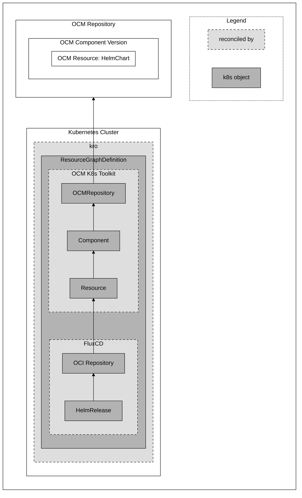

# OCM K8s Toolkit

> [!CAUTION]
> This project is in early development and not yet ready for production use.

OCM K8s Toolkit contains the tooling for
- providing the location of OCM resources from an OCM component version, so it can be consumed by a deployer. It is used
    to deploy OCM resources like a HelmChart or Kustomization into a Kubernetes cluster.
- providing a controller to transfer OCM component versions.

### What should I know before I start?

- You should be familiar with the [Open Component Model](https://ocm.software/)
- You should be familiar with the [Kubernetes](https://kubernetes.io/) ecosystem
- You should be familiar with [kro](https://kro.run)
- You should know about deployers that deploy HelmCharts or Kustomizations into Kubernetes clusters, e.g.
    [FluxCD](https://fluxcd.io/).

## Concept

> [!NOTE]
> The following section provides a high-level overview of the OCM K8s Toolkit and its components regarding the
> deployment of an OCM resource in a very basic scenario. To learn more about the transfer of OCM component versions,
> please take a look at its [architecture document](docs/architecture/replication.md).

An OCM component version can contain an OCM resource, like a HelmChart or Kustomization, that shall be deployed into a
Kubernetes Cluster.
Accordingly, a deployer, for instance FluxCD, needs to know where to find the OCM resource.
To transfer the information about the location of the OCM resource, another tool is required that can provide this
information. This should be done by referring to the OCM resource status as this information can be dynamic.
At this point, kro comes into play. Its `ResourceGraphDefinition` orchestrates Kubernetes resources and provides a way
to reference each resource using CEL-expressions.

Additionally, as OCM promises a secure delivery, we have to make sure that the OCM resource is still the same resource
it was, when the OCM component version was created.

To do so, OCM K8s Toolkit provides several custom Kubernetes resources and controllers to verify the OCM resources
as well as to publish the location of the OCM resources in its status.

As described in the above diagram, the base is an OCM resource containing a HelmChart. This OCM resource is part of an
OCM component version, which is located in an OCM repository.

The `ResourceGraphDefintion` contains all the Kubernetes custom resources (CR) to deploy the Helm Chart into the
Kubernetes cluster:
- `OCMRepository`: Points to the OCM repository and checks if it is reachable by pinging it.
- `Component`: Refers to the `OCMRepository` and downloads and verifies the OCM component version descriptor.
- `Resource`: Points to the `Component`, downloads the OCM component version descriptor from which it gets the location
of the OCM resource. It then downloads the resource to verify it (optional) and publishes the location of the resource
in its status (Of course, only if the resource has remote access, e.g., an OCI or a GitHub repository).

As a result, FluxCDs can now consume the information of the `Resource` and deploy the Helm Chart:
- `OCIRepository`: Watches and downloads the resource from the specified location that points to the `Resource` status.
- `HelmRelease`: Refers to the `OCIRepository` and deploys the Helm Chart into the Kubernetes cluster. 

A more detailed architecture description of the OCM K8s Toolkit can be found in
[here](docs/architecture/architecture.md).

## Installation

## Getting Started

- Basic usage
- Bootstrap usage

## Contributing

Code contributions, feature requests, bug reports, and help requests are very welcome. Please refer to the
[Contributing Guide in the Community repository](https://github.com/open-component-model/.github/blob/main/CONTRIBUTING.md)
for more information on how to contribute to OCM.

OCM K8s Toolkit follows the [CNCF Code of Conduct](https://github.com/cncf/foundation/blob/main/code-of-conduct.md).

## Licensing

Please see our [LICENSE](LICENSE) for copyright and license information.
Detailed information including third-party components and their licensing/copyright information is available
[via the REUSE tool](https://api.reuse.software/info/github.com/open-component-model/open-component-model).
