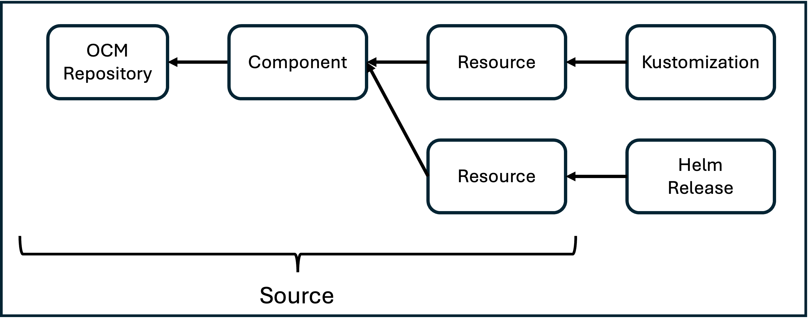

# OCM K8s Toolkit

[](https://api.reuse.software/info/github.com/open-component-model/ocm-k8s-toolkit)

## What is the OCM-K8S-Toolkit

The *OCM-K8S-Toolkit* is a set of *kubernetes custom resources* and
corresponding *controllers* that enable *continuous deployment* based on [*Open
Component Model*](https://ocm.software/) (OCM) *components*.

TLDR; Based on [*open flux*](https://github.com/openfluxcd), the composition of
3 *custom resources* and their corresponding *controllers* - *OCMRepository*,
*Component*, and *Resource* - serve as a flux
[*source*](https://fluxcd.io/flux/components/source/) (similiar to
[git repositories](https://fluxcd.io/flux/components/source/gitrepositories/),
[oci repositories](https://fluxcd.io/flux/components/source/ocirepositories/),
[s3 buckets](https://fluxcd.io/flux/components/source/buckets/), and
[helm](https://fluxcd.io/flux/components/source/helmrepositories/)), enabling
OCM as a flux source system.

Thus, the *OCM-K8S-Toolkit* enables the continuous
deployment of plain manifests, kustomize overlays and helm charts stored in OCM
components (so essentially, *OCMOps*).

> **Disclaimer**: This is a preliminary documentation to get a first glance at
> the ideas and principles behind the ocm-k8s-toolkit. Consequently, it is
> subject to significant change and might not always be up-to-date. Furthermore,
> the examples used in the explanation are currently just to make the topic
> more tangible - they do not actually exist and are not suited to follow along.

## Tools

### Core - OCM as Flux Source System

The core of the *OCM-K8S-Toolkit* is composed by the 3 aforementioned custom
resources and their controllers - *OCMRepository*, *Component*, and *Resource*.

Together, this composition serves as a flux
[*source*](https://fluxcd.io/flux/components/source/).



As the basis for the following explanations, we assume that we stored the *ocm
components* constructed by the
[ocm constructor](https://ocm.software/docs/getting-started/getting-started-with-ocm/create-a-component-version/#all-in-one)
shown below within an *ocm repository* (based on an
[oci registry](https://github.com/open-component-model/ocm-spec/blob/main/doc/04-extensions/03-storage-backends/README.md))
at ghcr.io/open-component-model.

```yaml
# yaml-language-server: $schema=https://ocm.software/schemas/configuration-schema.yaml
components:
- name: ocm.software/ocm-cli
  version: "6.1.3-rc.1"
  provider:
    name: ocm.software
  componentReferences:
  - componentName: ocm.software/ocm-cli/oci
    name: oci-component-reference
    version: "6.1.3-rc.1"

- name: ocm.software/ocm-cli/oci-image
  version: "6.1.3-rc.1"
  provider:
    name: ocm.software
  resources:
  - name: oci-image
    version: "6.1.3-rc.1"
    type: ociArtifact
    access:
      type: ociArtifact
      imageReference: ghcr.io/open-component-model/ocm/ocm.software/ocmcli/ocmcli-image:6.1.3-rc.1
```

#### OCM Repository

The *OCMRepository* is a custom resource containing an access description to an
ocm repository.

The purpose of the `OCMRepository` and the corresponding *ocm repository
controller* is to validate the described `repositorySpec`.

Besides syntactical correctness of the spec itself, this
validation also includes a kind of health check.
The health check itself is implemented in ocm and depends on the *type* of
repository.

##### Fields

```yaml
apiVersion: delivery.ocm.software/v1alpha1
kind: OCMRepository
metadata:
    namespace: default
    name: ocm-repo
spec:
    repositorySpec:
        type: OCIRegistry
        baseUrl: ghcr.io/open-component-model
    secretRefs:
    - name: ocm-secret
    configRefs:
    - name: ocm-config
    configSet: standard
    interval: 10m
    suspend: false
```

The `repositorySpec` (required) has to contain a valid ocm repository spec.
Here, it is for a repository of `type`
[*OCIRegistry*](https://github.com/open-component-model/ocm-spec/blob/main/doc/04-extensions/03-storage-backends/oci.md).
But theoretically, it could also be for a
[*CommonTransportFormat Archive*](https://github.com/open-component-model/ocm-spec/blob/main/doc/04-extensions/03-storage-backends/ctf.md)
or any other [ocm repository implementation](https://github.com/open-component-model/ocm-spec/blob/main/doc/04-extensions/03-storage-backends/README.md).

> **NOTE:** The other fields are common to all the custom resources and are
> therefore explained in a separate dedicated *common fields* section below.

#### Component

The *Component* is a custom resource specifying an *ocm component* to be
watched.

The purpose of the `Component` and the corresponding *component controller* is
to check a `OCMRepository` for the latest (relevant) version of a particular
component.

##### Fields

```yaml
apiVersion: delivery.ocm.software/v1alpha1
kind: Component
metadata:
  namespace: default
  name: ocm-comp
spec:
  repositoryRef:
    namespace: default
    name: ocm-repo
  component: ocm.software/ocmcli
  downgradePolicy: Deny
  semver: ">= 6.1.x-0"
  semverFilter: ".*-rc.*"
  verify:
  - signature: ocm
    secretRef:
      name: ocm-pk-secret
  secretRefs:
  - name: ocm-secret
  configRefs:
  - name: ocm-config
  configSet: standard
  interval: 10m
  suspend: false
```

The `repositoryRef` (required) references an `OCMRepository` and thereby
specifies where to look for the `component`.

The `component` (required) specifies the name of the component.

The `downgradePolicy` (optional) specifies whether the component may be
downgraded. The property is an enum with the 3 states: `Enforce`, `Allow`,
`Deny`, with `Deny` being the *default*.
In general, *ocm components* may specify their
*downgradability* through a label named
`ocm.software/ocm-k8s-toolkit/downgradable`. The value of the label has to be a
[semver constraint](https://github.com/Masterminds/semver#checking-version-constraints).
With respect to that, the `Allow` value means that the *downgradability* is
respected as specified by the *component version* author. Thus, if the label
is not set, downgrade is not possible. If the label specifies a *semver
constraint*, the currently applied *component version* is validated against this
constraint. If this validation succeeds (so, downgrade from the currently
applied version is possible), the component will be downgraded.
The `Deny` value means that regardless of the *downgradability* set by the
*component version* author, downgrade **is not** possible.
The `Enforce` value means that regardless of the *downgarability* set by the
*component version* author, downgrade **is** possible. **This setting should be
used with caution!**

The `semver` (optional) specifies a version constraint for the components to be
fetched in form of a [semver range](https://github.com/masterminds/semver#checking-version-constraints).

> **NOTE:** This is similiar to the `semver` property that can be specified for
> the tags of oci repositories in
> [flux](https://fluxcd.io/flux/components/source/ocirepositories/#reference).

The `semverFilter` (optional) specifies a regular expression that is applied to
*component versions* fetched from a `OCMRepository`. Only versions that match
the filter are considered for the `semver` range resolution.

> **NOTE:** This is similiar to the `semverFilter` property that can be
> specified for the tags of oci repositories in
> [flux](https://fluxcd.io/flux/components/source/ocirepositories/#reference).

The `verify` (optional) enables the verification of [component
signatures](https://github.com/open-component-model/ocm-spec/blob/main/doc/01-model/03-elements-sub.md#signatures).
The field consists of 3 subfields:

- `signature`, to specify the *component signature* (in the potential list of
  *component signatures* on the *ocm component*) to be verified.
- `secretRef`, to specify the *secret* containing the *public key* or the
  *certificate* in PEM format to be used for the verification.
- `value`, to specify the *public key* or the *certificate* in PEM/base64 format
  to be used for the verification.

The "inline" specification of the *public key* or the *certificate* through
`value` is an alternative to the `secretRef` - thus, these 2 properties are
mutually exclusive.

> **NOTE:** The other fields are common to all the custom resources and are
> therefore explained in a separate dedicated *common fields* section below.

#### Resource

The *Resource* is a custom resource specifying an *ocm resource* to be
watched.

The purpose of the `Resource` and the corresponding *resource controller* is
to expose a *resource* contained in an *ocm component* at a specific version as an *artifact*.

##### Fields

```yaml
apiVersion: delivery.ocm.software/v1alpha1
kind: Resource
metadata:
  namespace: default
  name: ocm-resource
spec:
  componentRef:
    namespace: default
    name: ocm-comp
  resourceSelector:
    resource:
      name: oci-image
    referencePath:
    - name: oci-component-reference
  secretRefs:
  - name: ocm-secret
  configRefs:
  - name: ocm-config
  configSet: standard
  interval: 10min
  suspend: false
```

The `componentRef` (required) references an `Component` and thereby
specifies where to look for the `resource`.

The `resourceSelector` (required) is a
[relative artifact reference](https://github.com/open-component-model/ocm-spec/blob/main/doc/05-guidelines/03-references.md#relative-artifact-references).
A [relative artifact reference](https://github.com/open-component-model/ocm-spec/blob/main/doc/05-guidelines/03-references.md#relative-artifact-references)
consists of a list of *component reference identities* specified in the
`referencePath` subfield and a *resource identity* specified in the `resource`
subfield (both, the artifact identity
and the component reference identities are referred to as
[element identities](https://github.com/open-component-model/ocm-spec/blob/main/doc/01-model/03-elements-sub.md#identifiers)
in the [ocm specification](https://github.com/open-component-model/ocm-spec/blob/main/README.md)).
Thereby, the list of *component reference identities* - the *reference path* -
specifies a path with the *referenced component* as the *root*. The *resource
identity* then specifies the particular *resource* within the *component*
specified through the *reference path*. This is analogous to a file system path,
with the *component references* as the directories and the *resource* as the
file.

> For details about the internals of the resource resolution and verification,
> see [here](./docs/architecture/)

> **NOTE:** The other fields are common to all the custom resources and are
> therefore explained in a separate dedicated *common fields* section below.

#### Common Fields

The `secretRefs` (optional) may reference one or multiple secrets that may
contain credentials (currently in the
[dockerconfigjson](https://kubernetes.io/docs/concepts/configuration/secret/#docker-config-secrets)
format or in the
[ocm credential format](https://github.com/open-component-model/ocm/blob/main/docs/reference/ocm_credential-handling.md))
or other
[ocm configs](https://github.com/open-component-model/ocm/blob/main/docs/reference/ocm_configfile.md).

The `configRefs` (optional) may reference one or multiple configmaps that may
contain [ocm configs](https://github.com/open-component-model/ocm/blob/main/docs/reference/ocm_configfile.md).

> **NOTE**: Generally, you would want configuration data to be readable. But
> since ocm configuration data might contain sensitive credentials, we offer the
> possibility to specify ocm configs in configmaps as well as in secrets.
> Soon, we will also support to reference secrets within an ocm config as
> a convenient solution for this kind of situation.

The `configSet` (optional) is an ocm concept which allows to specify multiple
[sets of configurations](https://github.com/open-component-model/ocm/blob/main/docs/reference/ocm_configfile.md)
(for example, a set called `test` with ocm configurations for testing and
another set called `development` with alternative ocm configurations for
development).

The `interval` (required) is a common property for flux custom resources as
documented [here](https://fluxcd.io/flux/components/source/gitrepositories/#interval).
In general, it specifies the time interval in which the custom
resource is reconciled again. So thereby, in case of the `Component` custom
resource, e.g. the time interval in which the *component controller* checks the
repository for newer versions of the corresponding *ocm component*. Meanwhile,
it also serves as a drift detection.
But it is **important** to notice, this interval is also used as the retry
interval for some particular failure cases. In case of the `Component` custom
resource, e.g. if the *component controller* fails to find the *ocm component*
in the specified *ocm repository*, it will wait for the duration specified in
the `interval` until it will try again. Therefore, setting the interval quite
high can lead to unexpected behaviour in regard to recovery time.

The `suspend` (optional) is a common property for flux custom resources as
documented [here](https://fluxcd.io/flux/components/source/gitrepositories/#suspend).
It suspends the reconciliation.

## Support, Feedback, Contributing

This project is open to feature requests/suggestions, bug reports etc. via [GitHub issues](https://github.com/SAP/ocm-k8s-toolkit/issues). Contribution and feedback are encouraged and always welcome. For more information about how to contribute, the project structure, as well as additional contribution information, see our [Contribution Guidelines](CONTRIBUTING.md).

## Code of Conduct

We as members, contributors, and leaders pledge to make participation in our community a harassment-free experience for everyone. By participating in this project, you agree to abide by its [Code of Conduct](CODE_OF_CONDUCT.md) at all times.

## Licensing

Copyright 2025 SAP SE or an SAP affiliate company and ocm-k8s-toolkit contributors. Please see our [LICENSE](LICENSE) for copyright and license information. Detailed information including third-party components and their licensing/copyright information is available [via the REUSE tool](https://api.reuse.software/info/github.com/open-component-model/ocm-k8s-toolkit).
