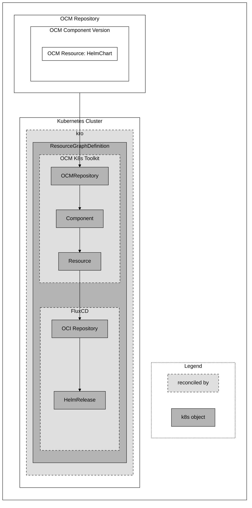

# OCM K8s Toolkit

[](https://api.reuse.software/info/github.com/open-component-model/ocm-k8s-toolkit)

> [!CAUTION]
> This project is in early development and not yet ready for production use.

The OCM K8s Toolkit
- supports the deployment of an OCM component and its resources, like Helm charts or other manifests,
into a Kubernetes cluster with the help of kro and a deployer, e.g. FluxCD.
- provides a controller to transfer OCM components.

### What should I know before I start?

You should be familiar with the following concepts:
- [Open Component Model](https://ocm.software/)
- [Kubernetes](https://kubernetes.io/) ecosystem
- [kro](https://kro.run)
- Kubernetes resource deployer such as [FluxCD](https://fluxcd.io/).

## Concept

> [!NOTE]
> The following section provides a high-level overview of the OCM K8s Toolkit and its components regarding the
> deployment of an OCM resource in a very basic scenario. To learn more about the *transfer* of OCM component versions,
> please take a look at its [architecture document](docs/architecture/replication.md).

The primary purpose of OCM K8s Toolkit is simple: Deploy an OCM resource from an OCM component version into a Kubernetes
cluster.

The implementation, however, is a bit more complex as deployments must be secure and configurable. Additionally, an
OCM Resource can, in theory, contain any form of deployable resource, for instance a Helm chart, a Kustomization, or
plain Kubernetes manifests. Each of these resources has its own way of being deployed or
configured. So, instead of creating a generic deployer that offers all these functionalities, we decided to use existing
tools that are already available in the Kubernetes ecosystem.

The following diagram describes a basic scenario in which an OCM resource containing a Helm chart is deployed into a
Kubernetes cluster using the OCM K8s Toolkit as well as kro and FluxCD.
kro is used to orchestrate the deployment and to transport information about the location of the OCM resource to FluxCD.
FluxCD takes the location of the OCM resource, downloads the chart, configures it if necessary,
and deploys it into the Kubernetes cluster.



The above diagram shows an OCM resource of type `helmChart`. This resource is part of an OCM component version,
which is located in an OCM repository.

In the `Kubernetes Cluster` we can see several Kubernetes (custom) resources. The `ResourceGraphDefintion` contains all
the resources to deploy the Helm chart into the Kubernetes cluster:
- `OCMRepository`: Points to the OCM repository and checks if it is reachable by pinging it.
- `Component`: Refers to the `OCMRepository` and downloads and verifies the OCM component version descriptor.
- `Resource`: Points to the `Component`, downloads the OCM component version descriptor from which it gets the location
of the OCM resource. It then downloads the resource to verify its signature (optional) and publishes the location of the resource
in its status (Of course, only if the resource has remote access, e.g., an OCI or a GitHub repository).

As a result, FluxCDs can now consume the information of the `Resource` and deploy the Helm chart:
- `OCIRepository`: Watches and downloads the resource from the location provided by the `Resource` status.
- `HelmRelease`: Refers to the `OCIRepository`, lets you configure the Helm chart, and deploys it into the
Kubernetes cluster.

A more detailed architecture description of the OCM K8s Toolkit can be found [here](docs/architecture/architecture.md).

## Installation

Currently, the OCM K8s Toolkit is available as [image][controller-image] and
[Kustomization](config/default/kustomization.yaml). A Helm chart is planned for the future.

To install the OCM K8s Toolkit into your running Kubernetes cluster, you can use the following commands:

```console
# In the ocm-k8s-toolkit/ repository
make deploy
```

or

```console
kubectl apply -k https://github.com/open-component-model/ocm-k8s-toolkit/config/default?ref=main
```

> [!IMPORTANT]
> OCM K8s Toolkit requires kro and a deployer, e.g. FluxCD, to deploy an OCM resource into a Kubernetes cluster.
> The OCM K8s Toolkit deployment, however, does not contain kro or any deployer. Please refer to the respective
> installation guides for these tools:
> - [kro](https://kro.run/docs/getting-started/Installation/)
> - [FluxCD](https://fluxcd.io/docs/installation/)

## Getting Started

- [Setup your (test) environment with kind, kro, and FluxCD](docs/getting-started/setup.md)
- [Deploying a Helm chart using a `ResourceGraphDefinition` with FluxCD](docs/getting-started/deploy-helm-chart.md)
- [Deploying a Helm chart using a `ResourceGraphDefinition` inside the OCM component version (bootstrap) with FluxCD](docs/getting-started/deploy-helm-chart-bootstrap.md)
- [Configuring secrets for OCM K8s Toolkit resources to access private OCM repositories](docs/getting-started/secrets.md)
- [Transfer OCM component versions](docs/getting-started/transfer.md)

## Contributing

Code contributions, feature requests, bug reports, and help requests are very welcome. Please refer to our
[Contributing Guide](https://github.com/open-component-model/.github/blob/main/CONTRIBUTING.md)
for more information on how to contribute to OCM.

OCM K8s Toolkit follows the [CNCF Code of Conduct](https://github.com/cncf/foundation/blob/main/code-of-conduct.md).

## Licensing

Please see our [LICENSE](LICENSE) for copyright and license information.
Detailed information including third-party components and their licensing/copyright information is available
[via the REUSE tool](https://api.reuse.software/info/github.com/open-component-model/open-component-model).


[controller-image]: https://github.com/open-component-model/ocm-k8s-toolkit/pkgs/container/ocm-k8s-toolkit
