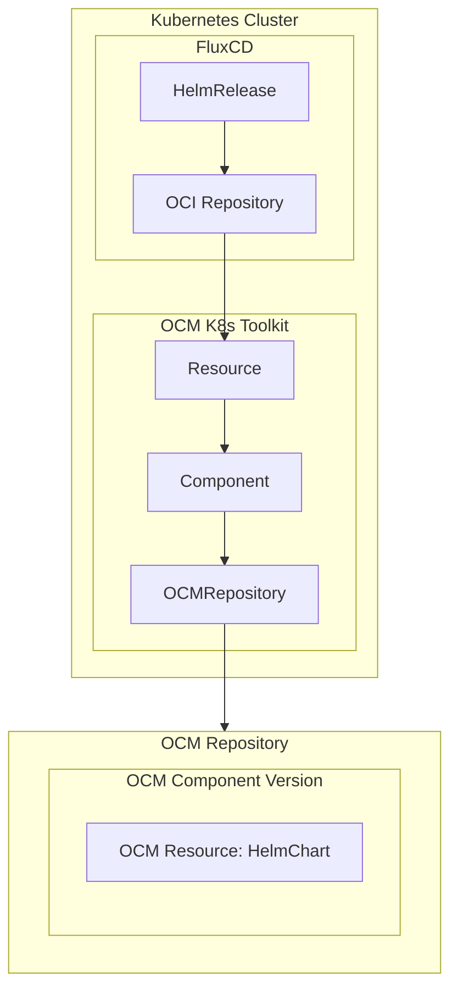

# OCM K8s Toolkit

> [!IMPORTANT]
> This project is in early development and not yet ready for production use.

OCM K8s Toolkit contains the tooling for
- providing the location of OCM resources from an OCM component version, so it can be consumed by a deployer. It is used
    to deploy OCM resources like a HelmChart or Kustomization into a Kubernetes cluster.
- providing a controller to transfer OCM component versions.

### What should I know before I start?

- You should be familiar with the [Open Component Model](https://ocm.software/)
- You should be familiar with the [Kubernetes](https://kubernetes.io/) ecosystem
- You should know about deployers that deploy HelmCharts or Kustomizations into Kubernetes clusters, e.g.
    [FluxCD](https://fluxcd.io/).

## Concept

The following section provides a high-level overview of the OCM K8s Toolkit and its components regarding the deployment
of an OCM resource in a very basic scenario. To learn more about the transfer of OCM component versions, please take a
look at its [architecture document](architecture/replication.md).

An OCM component version can contain an OCM resource, like a HelmChart or Kustomization, that shall be deployed into a
Kubernetes Cluster.
Accordingly, a deployer, for instance FluxCD, needs to know where to find the OCM resource.
Additionally, as OCM promises a secure delivery, we have to make sure that the OCM resource is still the same resource
it was, when the OCM component version was created.

To do so, OCM K8s Toolkit provides several custom Kubernetes resources and controllers to verify the OCM resources as
well as to publish the location of the OCM resources in its status.

As described in the above diagram, the base is an OCM resource containing a HelmChart. This OCM resource is part of an
OCM component version, which is located in an OCM repository.

The Kubernetes Custom Resource (CR) `OCMRepository` points to the OCM repository and checks if it is reachable.
The CR `Component` points to the `OCMRepository`, downloads the OCM component version descriptor and verifies it.
The CR `Resource` points to the `Component`, from which it gets the information where to access the resource and
publishes the location in its status (only if the resource-location is of a kind that is remotely reachable).

As a result, FluxCDs `OCIRepository` can be used to access the content of the OCM resource by referring to the location
of the resource (assuming it is an HelmChart stored in an OCI repository) and make it consumable for FluxCDs
`HelmRelease`.

## Installation

## Getting Started

- Basic usage
- Bootstrap usage

## Contributing

Code contributions, feature requests, bug reports, and help requests are very welcome. Please refer to the
[Contributing Guide in the Community repository](https://github.com/open-component-model/.github/blob/main/CONTRIBUTING.md)
for more information on how to contribute to OCM.

OCM K8s Toolkit follows the [CNCF Code of Conduct](https://github.com/cncf/foundation/blob/main/code-of-conduct.md).

## Licensing

Please see our [LICENSE](LICENSE) for copyright and license information.
Detailed information including third-party components and their licensing/copyright information is available
[via the REUSE tool](https://api.reuse.software/info/github.com/open-component-model/open-component-model).
