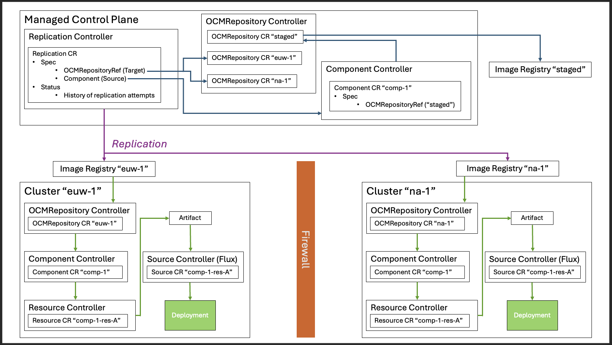

# Replication

* Status: proposed
* Deciders: @fabianburth @jakobmoellerdev @frewilhelm @ikhandamirov 

Technical Story: 

Replication controller integrated into the ocm-k8s-toolkit mimics the `ocm transfer` behaviour into a controller. This allows transferring components from one registry to another  registry. A possible use case would be that the replication controller is running in an MCP cluster. One can subscribe to a certain component CR and each time the component version is updated in the CR, the newer version is automatically replicated to one or several target environments. The target environments are specified by OCMRepository CRs.

See also: 

# Problem Statement and Proposed Solutions

## Problem 1: Will replication always only work on the latest or on all in spec (SemVer of Component status)?

Options:
1. Replicate all component versions fitting to semver specified in the Component CR Spec
2. Only replicate the latest version mentioned in the Component CR Status

Proposed solution:
* ..., because... 

Possible consequences: ...

## Problem 2: Should a successful replication automatically result in creation of a component and resource CRs?

Options:
1. Yes, always create
2. Yes, if possible and desirable by the user
3. No

Proposed solution:
* ..., because... 

Possible consequences: ...

## Problem 3: How many replication attempts do you want to keep in replication CR status?

Options:
* Unlimited
* Hardcoded limit
* CR-specific limit + default, if not specified in the CR
* Retain all not older then X days

Proposed solution:
* ..., because... 

Possible consequences: ...

## Problem 4: How to specify the transfer options?

Options:
1. As fields of the Replication CR
2. As ocmconfig of config type 'transport.ocm.config.ocm.software' stored in a separate k8s object

Note that:
* config type 'transport.ocm.config.ocm.software' would need to be extended to support more command line options
* same question applies to uploader configuratio
* `--lookup` seems to be a special case. A solution could be to introduce a possibility to specify several source OCMRepository objects.

Proposed solution:
* ..., because... 

Possible consequences: ...

## Problem 5: Should the Replication controller take the Artifact CR prepared by the Component Controller into account?

Options:
1. No, provide the OCM Lib with source coordinates and let it download the component version from scratch.
2. ...

Proposed solution:
* ..., because... 

Possible consequences: ...

## Problem 6: How to check the desired state of the Replication?

Options 1: Check the state of the component in the target registry

Decision driver: How do we know, if the state of the component in the target repository fits the current transfer options?

Option 2: Check the history (status)

Option 3: Never check for desired state. Trigger the replication with every call to reconciler. Have no interval or large enough interval?

Proposed solution:
* ..., because... 

Possible consequences: ...

## Problem 7: Do we need to store ocmconfig with transfer options in a dedicated field in the Spec?

and a dedicated field in the Status with transfer options as clear text.

Options:
1. No, use generic ConfigRefs
2. Yes, use a dedicated field with a reference to a ConfigMap

Decision driver: an SRE might need a way to quickly find which transfer options an individual replication run was executed with.

Note: same question applies to uploader configuration.

Proposed solution:
* ..., because... 

Possible consequences: ...

## Problem 8: Should a Replication CR support several target OCMRepositories?

Options:
1. No, have one Replication CR per target repository
2. Yes, have one Replication CR to control replication to several target repositories.

Decision drivers: should be simple from ops / debugging PoV.
