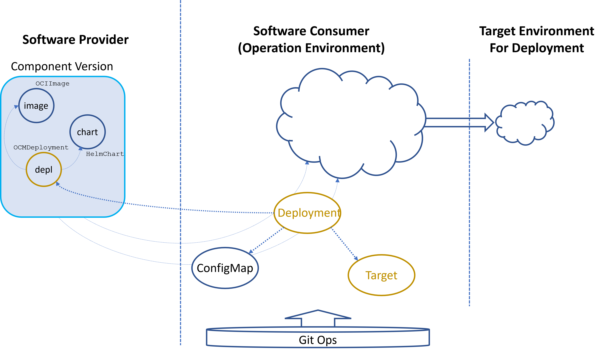
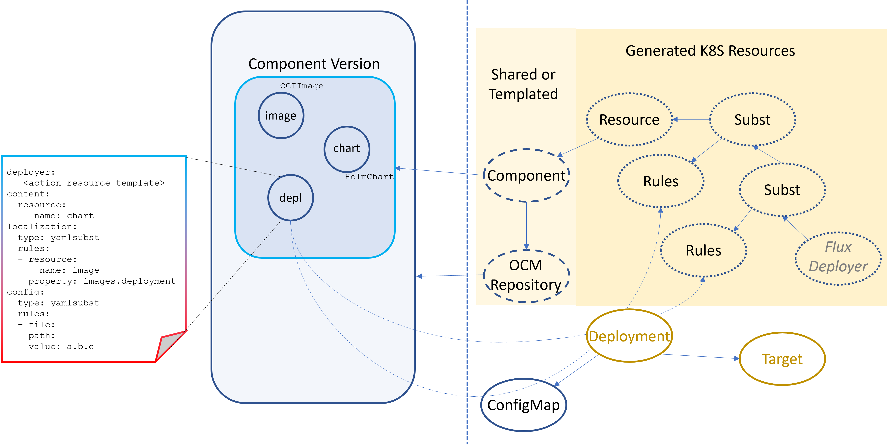

# Deployments

* Status: proposed
* Deciders: Gergely Brautigam, Fabian Burth, Jakob Moeller, Uwe Krueger
* Date: 2024-10-22

## Technical Story

With the OCM controllers we have a solid base to compose complex deployment chains using GitOps mechanisms referring to
content delivered via OCM component versions.

The involved resources are very low level. This is required to be able to use them in arbitrary, potentially highly
specialized environments, but it requires in-depth knowledge of the involved steps to create and operate such a design.

The description on both sides, the provisioning of an OCM component version and the maintenance of the deployment
pipeline of the installation side tend to be quite complex.

Because the involved steps are always similar, this can be a way to describe some standard pattern for describing a
deployment based on this basic infrastructure, which requires less knowledge and effort when applying this model to
deploy applications described by the Open Component Model.

While the low-level approach seems to be applicable for single products it is likely inadequate for the delivery and
installation of hundreds of products operated by a non-development team. It requires a uniform way to handle the
deployments of an arbitrary number of involved service providers. Therefore, a uniform way to handle a basic deployment
is required. This deployment then may execute more specialized and complex deployment steps (product operator approach).

This ADR provides a possibility to standardize and reduce the description effort to bundle the deployment description
on the provider side and the installation request on the consumer side to some kind of single resource.

## Basic Solution Idea

On the provider side the development team has to provide a component version with all the artifacts required for a
deployment. Additionally, a separate declarative content has to be provided describing the intended deployment.

All those artifacts are typed. This is especially true for this additional deployment resource. Its type is used to
match the deployment resource of the consumption side and it represents a method understandable by the deployment controller.

- This artifact describes all the required resources belonging to the deployment. This is
  - all *technical resources* to be referenced from the technical deployment (for example OCI images)
  - a *deployment template* for the deployer used by the pipeline to feed the target environment (for example a Helm Chart or a Kustomize template)

- It describes the rules how location of the resources have to be injected into the deployment template.

- It describes a value structure for intended configuration options, which might be provided by the operational
  environment used to manage dedicated deployment instances.

- It describes how those values are injected into the deployment template.

On the side of the operational environment, the deployment side, the operator describes a deployment resource (matching
the type of the deployment artifact in the OCM component version).

It refers to an object with the deployment specific configuration values, and to a target, which describes the
deployment target. The deployment resource then describes the deployment source by referencing the deployment artifact
in an OCM component version found in some OCM repository (possible replicated to the operational environment).

The controller responsible for the K8S deployment resource has then the task to manage the complete deployment pipeline,
consisting of the OCM-related K8S resources and the Flux resources used for the deployment. This pipeline is then
responsible for providing the final deployment in the intended target environment.

## Improvements for the OCM controllers

A typical basic pipeline layout consists of several steps.
- The deployment template described by the OCM deployment artifact is made consumable for the Flux-based deployment
  pipeline. This can be achieved by the OCM K8s resource `Resource`.
- The next step is to apply localization rules to the provided content, injecting the locations of the various
  deployment artifacts (like OCI images).

The previous steps are basically independent of the actual deployment, they only depend on the delivered content and
the local repository. The following steps are specific for the concrete deployments.

- The localized deployment template must be configured for a dedicated deployment.
- The final deployment result (localized and configured) is then passed to a deployer which is responsible to execute
the deployment.

Localization and Configuration are technically the same operations but acting on different data:
- Localization takes a result and modification rules derived from the localization rules delivered together with the
component version and the locations of the required artifacts as described by the used descriptor of the component version.
- Configuration takes a result and modification rules derived from the configuration rules delivered together with the
component version and configuration values provided by the object referenced by the K8S deployment resource.
- Configuration can be applied multiple times based on different environment requirements to the same localized object.
  For example: dev, staging, prod.

The rules engine itself depends only on the kind of result and the modification technology (for example field-based
substitution of yaml documents).

Therefore, it seems to be useful to separate the creation of the effective modification rules from the execution engine.
This allows to use the same technical rules engine (and the related K8S resource types). It should replace the separated
configuration and localization resources so far provided by the OCM controllers.

## The Deployment Layout

The task of deployment controller is to generate and maintain the K8S resources of the deployment pipeline.

The final deployer resource depends on the artifact type of the deployment template as described by the OCM component version.
It can explicitly be defined as template in the deployment description or defaulted based on the artifact type. For example
known types such as Resource, Configuration, Localization, etc...

It must template the Flux source resource and the target. Therefore, the K8S target resource must provide the appropriate
values applicable for the applied deployer template.

The K8S deployment resource may refer to a K8S component resource or provide an appropriate template. If such a template
is provided, the OCM repository resource, can again be provided per reference to an existing one, or by a repository template.

In any case the K8S deployment resource denotes the OCM resource for the deployment description.
Similar to the current low-level approach, the deployment template is provided by the controller via a K8s `Resource`
resource, directly configured according to the content of the deployment description. If described it extracts the rules
for the localization and configuration and manages the appropriately typed rules and modification resources. In a first
step there will only be two modification engines:
- *yamlsubst* for file based substitution of yaml paths
- *gotemplate* for arbitrary text based files

The modification resources are chained with the initial `Resource` resource and the passed to the templates Flux deployer resource.

## Descriptor and Resource Formats

### Deployment descriptor stored as OCM resource

### K8S deployment Resource

### K8S Target Resource

### K8S Yamlsubst and rules Resource

### K8S Gotemplate and rules Resource

