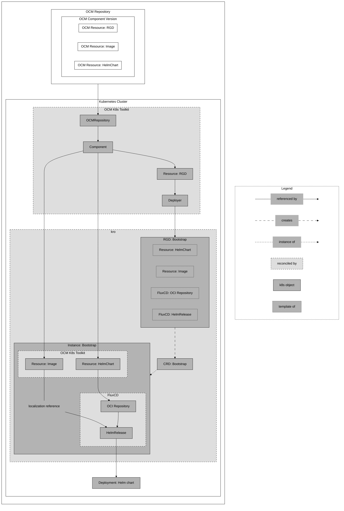

# Deploying a Helm Chart using a `ResourceGraphDefinition` inside the OCM component version (bootstrap) with FluxCD

The [concept](../../README.md#concept) showed a basic example of how to deploy a Helm chart using the OCM K8s Toolkit,
in which an operator or dev-ops engineer can define a `ResourceGraphDefinition` to deploy a Helm chart into a Kubernetes
cluster. However, there are scenarios, where the developer already knows how the deployment should look like and what
should be configured. So, the developer can already create a `ResourceGraphDefinition` and deliver it with the OCM
component.

In such a case, we need to bootstrap the `ResourceGraphDefinition` from the OCM component and apply it to the cluster.
To do so, we use the OCM K8s Toolkit resource `deployer`. By referencing a `Resource` by name, the deployer will
download the `ResourceGraphDefinition` (RGD) from the OCM component and apply it to the cluster:





> [!NOTE]
> This document is under construction. Please refer to https://github.com/open-component-model/ocm-project/issues/487

> [!IMPORTANT]
> This guide is preliminary and will be updated in the future.

The following instructions will help you set up the project locally to play around with its examples. To do so
these requirements are needed:

- Running Kubernetes Cluster, e.g [KinD](https://kind.sigs.k8s.io/docs/user/quick-start/)
- [kubectl](https://kubernetes.io/docs/tasks/tools/#kubectl)
- [Flux CLI](https://fluxcd.io/flux/installation/)
- [Kro](https://kro.run/docs/getting-started/Installation/)
- [ocm](https://ocm.software/docs/getting-started/installing-the-ocm-cli/)

## Setup the environment

### Install Flux controllers

```bash
flux install
```

### Install ocm-controllers

```bash
# Make sure you are in your local ocm-k8s-toolkit repository
make deploy
```

## Prepare the example

To run the examples, we need to create an OCM component version and store it in an OCI registry, e.g. GitHub's
container registry. (We chose the example "helm-configuration-localization" for this guide, but you can choose any of
the examples in the `examples` folder.)

The following command will create an OCM component version from the example's `component-constructor.yaml` file and
store it in a local ctf (component transfer format) directory.

```bash
# Make sure you are in your local ocm-k8s-toolkit repository
ocm add componentversions --create --file ./ctf \
  examples/helm-configuration-localization/component-constructor.yaml
```

The following command will transfer the local ctf to your specified registry. For this example, we used GitHub's
container registry, but you can use any OCI registry. Additionally, we used the flag `--copy-resources` to copy the
resources from the local ctf to the registry.

```bash
# Make sure you are in the same directory as before 
ocm transfer ctf --copy-resources ./ctf ghcr.io/<your-username/org>
```

> [!IMPORTANT]
> The ocm-controllers need to be able to access the OCI registry, in which the OCM component version is stored. So, you
> either must provide [credentials][ocm-credentials] for the OCI registry or make the OCM component version public.
>
> Quick Guide:
> Assuming you work with a configuration file like `.ocmconfig`, you can use `kubectl create secret generic my-secret --from-file=.ocmconfig`
> to create the secret and the following fields to use it (for every resource that requires it):
> ```yaml
> apiVersion: delivery.ocm.software/v1alpha1
> kind: OCMRepository
> metadata:
>   name: helm-configuration-localization-repository
> spec:
>   repositorySpec:
>     baseUrl: ghcr.io/<your-username/org>
>     type: OCIRegistry
>   interval: 10m
>   ocmConfig:
>     - kind: Secret
>       name: my-secret
>       namespace: default
> ```

At last, we need to adjust the OCM repository in the CR `ocmrepository` to point to the OCI registry we specified
above. Open the file `examples/helm-configuration-localization/bootstrap.yaml` and change the field `baseUrl`.

```yaml
apiVersion: delivery.ocm.software/v1alpha1
kind: OCMRepository
metadata:
  name: helm-configuration-localization-repository
spec:
  repositorySpec:
    # Adjust to your OCM repository
    baseUrl: ghcr.io/<your-username/org> 
    type: OCIRegistry
  interval: 10m
```

### Make sure all required controllers are running

```bash
kubectl get pods --all-namespaces
```
```
NAMESPACE                NAME                                                      READY   STATUS    RESTARTS   AGE
flux-system              helm-controller-b6767d66-qxp52                            1/1     Running   0          18m
flux-system              kustomize-controller-57c7ff5596-7dc6l                     1/1     Running   0          18m
flux-system              notification-controller-58ffd586f7-7qv6k                  1/1     Running   0          18m
flux-system              source-controller-6ff87cb475-bf5lf                        1/1     Running   0          18m
kro                      kro-86d5b5b5bd-jxcf6                                      1/1     Running   0          16m
...
ocm-k8s-toolkit-system   ocm-k8s-toolkit-controller-manager-788f58d4bd-j8qk2       1/1     Running   0          15m
```

## Run the example

To run the example, we need to apply the `bootstrap.yaml` file. This file contains all the necessary resources to
bootstrap the `ResourceGraphDefinition` that will deploy our resources from our OCM component version we just created
and transferred.

```bash
# Make sure you are in your local ocm-k8s-toolkit repository
kubectl apply -f examples/helm-configuration-localization/bootstrap.yaml
```

If everything went well, we should see the following output:

```bash
kubectl get rgd
```
```
NAME                              APIVERSION   KIND                            STATE    AGE
helm-configuration-localization   v1alpha1     HelmConfigurationLocalization   Active   38s
```

If our `ResourceGraphDefinition` is in the state `Active`, we can apply an instance of the new created CRD
`HelmConfigurationLocalization`. This will create all resources defined in the `ResourceGraphDefinition` (check
`examples/helm-configuration-localization/rgd.yaml`).

```bash
# Make sure you are in your local ocm-k8s-toolkit repository
kubectl apply -f examples/helm-configuration-localization/instance.yaml
```

If the instance is created successfully, we should see the following output for the CRD:

```bash
kubectl get HelmConfigurationLocalization
```
```
NAME                              STATE    SYNCED   AGE
helm-configuration-localization   ACTIVE   True     37s
```

We can also check if the deployment was created successfully. The deployment should be in the state `Available`:

```bash
kubectl get deployments
```
```
NAME                                      READY   UP-TO-DATE   AVAILABLE   AGE
helm-configuration-localization-podinfo   1/1     1            1           38s
```

If the deployment was created successfully, we can check if the pod was created successfully.
The pod should be in the state `Running`:

```bash
kubectl get pods
```
```
NAME                                                      READY   STATUS    RESTARTS   AGE
helm-configuration-localization-podinfo-99c4fd587-qdlzh   1/1     Running   0          48s
```

We can check if the localization was successful by checking the image of the container. It should correspond to the
OCI registry we transferred the OCM component version to.

```bash
kubectl get pods -l app.kubernetes.io/name=helm-configuration-localization-podinfo -o jsonpath='{.items[0].spec.containers[0].image}'
```
```
ghcr.io/<your username/org>/stefanprodan/podinfo:6.7.1
```

We can also check if the configuration was successful by checking the environment variables of the container. We expect
the environment variable `PODINFO_UI_MESSAGE` to be set to `helm-configuration-localization` as specified in the
instance.

```bash
kubectl get pods -l app.kubernetes.io/name=helm-configuration-localization-podinfo -o jsonpath='{.items[0].spec.containers[0].env}'
```
```
[{"name":"PODINFO_UI_MESSAGE","value":"helm-configuration-localization"},{"name":"PODINFO_UI_COLOR","value":"#34577c"}]
```


[ocm-credentials]: https://ocm.software/docs/tutorials/credentials-in-.ocmconfig-file/#accessing-oci-registries
