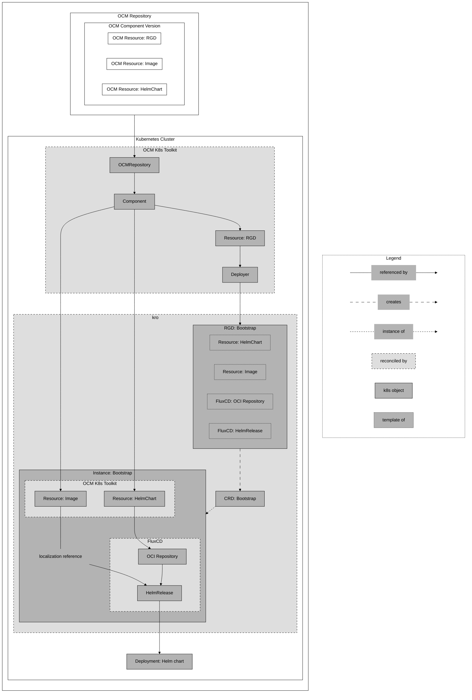

# Deploying a Helm Chart using a `ResourceGraphDefinition` inside the OCM component version (bootstrap) with FluxCD

The [concept](../../README.md#concept) showed a basic example of how to deploy a Helm chart using the OCM K8s Toolkit,
in which an operator or dev-ops engineer can define a `ResourceGraphDefinition` to deploy a Helm chart into a Kubernetes
cluster. However, there are scenarios, where the developer already knows how the deployment should look like and what
should be configured. So, the developer can create a `ResourceGraphDefinition` beforehand and deliver it with the OCM
component itself.

In such a case, we need to bootstrap the `ResourceGraphDefinition` from the OCM component and apply it to the cluster.
To do so, we use the OCM K8s Toolkit resource `Deployer`. By referencing the `Resource` containing the
`ResourceGraphDefinition` by name, the deployer will download the content from the OCM component and apply it to the
cluster.

The following guide demonstrates how to deploy a Helm chart using a `ResourceGraphDefinition` that is also delivered
with the same OCM component. Additionally, it shows how to **localize** a Helm chart.

> [!NOTE]
> **Localization** describes the process of inserting a new image reference into a deployment instruction, e.g. a Helm
> chart. It is a two-step process:
> 1. When an OCM component and its resources are transferred to another registry, the resources of type `OCI Artifact`
> with an access pointing to an image reference, will update this image reference to the new registry location in
> their respective component descriptors (For example, if you use the command `ocm transfer ctf --copy-resources...`).
> 2. However, the deployment using the image, is not aware of this change. Accordingly, we need to insert the new image
> reference into the deployment instruction, for instance by using FluxCD's `HelmRelease.spec.values`-field for Helm
> charts.

The following diagram shows an overview of the resources and their relationships of this guide:



As the diagram shows, we will start by creating an OCM component that contains three resources:
- An OCM Resource of type `HelmChart` that contains the Helm chart we want to deploy.
- An OCM Resource of type `Image` that contains the image reference we want to use for the deployment and
  localization.
- An OCM Resource of type `RGD` that contains the `ResourceGraphDefinition` that will deploy the Helm chart and
  configure the localization.

To enable the bootstrap of the `ResourceGraphDefinition`, we will create the respective OCM K8s Toolkit resources that
point to the OCM repository (`OCMRepository`), the OCM component version (`Component`), and the OCM Resource
(`Resource`) that contains the `ResourceGraphDefinition`. The OCM K8s Toolkit resource `Deployer` will refer to the
aforementioned `Resource`, download the `ResourceGraphDefinition`, and apply it to the cluster.

kro will reconcile this `ResourceGraphDefinition` and create a Custom Resource Definition (CRD). By creating an
instance of that CRD, we will deploy the resources defined in the `ResourceGraphDefinition`:
- A OCM K8s Toolkit resource "HelmChart" of type `Resource` that contains the location of the Helm chart in its status.
- A OCM K8s Toolkit resource "Image" of type `Resource` that contains the image reference for the localization in its
  status.
- A FluxCD resource of type `OCIRepository` that points to the location of the Helm chart retrieved from the status of
  the resource "HelmChart".
- A FluxCD resource of type `HelmRelease` that points to the FluxCD `OCIRepository`, gets the Helm chart, and replaces
  the image location in the deployment using its `spec.values` field and the status of the resource "Image" that
  contains the image reference.

Finally, we will check if the deployment was successful and if the localization was applied correctly.

> [!IMPORTANT]
> Before starting, make sure you have set up your environment as described in the [setup guide](setup.md).


## Create the OCM component version

First, we will create an OCM component version containing a Helm chart, the application image that is used in the Helm
chart, and the `ResourceGraphDefinition` that contains all required resource to deploy the Helm chart and configure the
localization. For this example, we will use the `podinfo` Helm chart and image, which is a simple web application that
serves a pod information page. For more details on how to create an OCM component version, please refer to the
[OCM documentation][ocm-doc].

To create the OCM component version, we will use the following `component-constructor.yaml` file:

```yaml
components:
  - name: ocm.software/ocm-k8s-toolkit/bootstrap
    version: "1.0.0"
    provider:
      name: ocm.software
    resources:
      - name: helm-resource
        type: helmChart
        version: "1.0.0"
        access:
          type: ociArtifact
          imageReference: ghcr.io/stefanprodan/charts/podinfo:6.7.1
      - name: image-resource
        type: ociArtifact
        version: "1.0.0"
        access:
          type: ociRegistry
          imageReference: ghcr.io/stefanprodan/podinfo:6.7.1
      - name: resource-graph-definition
        type: blob
        version: "1.0.0"
        input:
          type: file
          path: ./resourceGraphDefinition.yaml
```

As you can see, the resource `resource-graph-definition` is of type `blob` and contains the path to a file
`resourceGraphDefinition.yaml`. Before we can create the OCM component version, we need to create this file, with the
following content:

```yaml
apiVersion: kro.run/v1alpha1
kind: ResourceGraphDefinition
metadata:
  name: bootstrap
spec:
  schema:
    apiVersion: v1alpha1
    kind: bootstrap
  resources:
    # In this guide, we will not create a "OCMRepository" and "Component" in this ResourceGraphDefinition. Those
    # resources will be created to bootstrap the ResourceGraphDefinition itself and are already present to be
    # referenced by the following resources.

    # This resource refers to the resource "helm-resource" defined in the OCM component version. It will be downloaded,
    # verified, and its location is made available in the status of the resource.
    - id: resourceChart
      template:
        apiVersion: delivery.ocm.software/v1alpha1
        kind: Resource
        metadata:
          name: bootstrap-helm-resource
        spec:
          # This component will be part of the bootstrap resources that will be created later.
          componentRef:
            name: bootstrap-component
          resource:
            byReference:
              resource:
                name: helm-resource
          interval: 10m
    # This resource refers to the resource "image-resource" defined in the OCM component version. It will be downloaded,
    # verified, and its location is made available in the status of the resource.
    - id: resourceImage
      template:
        apiVersion: delivery.ocm.software/v1alpha1
        kind: Resource
        metadata:
          name: bootstrap-image-resource
        spec:
          # This component will be part of the bootstrap resources that will be created later.
          componentRef:
            name: bootstrap-component
          resource:
            byReference:
              resource:
                name: image-resource
          interval: 10m
    # OCIRepository watches and downloads the resource from the location provided by the Resource status.
    # The Helm chart location (url) refers to the status of the resource helm-resource.
    - id: ocirepository
      template:
        apiVersion: source.toolkit.fluxcd.io/v1beta2
        kind: OCIRepository
        metadata:
          name: bootstrap-ocirepository
        spec:
          interval: 1m0s
          insecure: true
          layerSelector:
            mediaType: "application/vnd.cncf.helm.chart.content.v1.tar+gzip"
            operation: copy
          url: oci://${resourceChart.status.reference.registry}/${resourceChart.status.reference.repository}
          ref:
            tag: ${resourceChart.status.reference.tag}
    # HelmRelease refers to the OCIRepository, lets you configure the helm chart and deploys the Helm Chart into the
    # Kubernetes cluster.
    - id: helmrelease
      template:
        apiVersion: helm.toolkit.fluxcd.io/v2
        kind: HelmRelease
        metadata:
          name: "${schema.spec.podinfo.releaseName}"
        spec:
          releaseName: "${schema.spec.podinfo.releaseName}"
          interval: 1m
          timeout: 5m
          chartRef:
            kind: OCIRepository
            name: ${ocirepository.metadata.name}
            namespace: default
          values:
            # This is the second step of the localization. We use the image reference from the resource "image-resource"
            # and insert it into the Helm chart values.
            image:
              repository: ${resourceImage.status.reference.registry}/${resourceImage.status.reference.repository}
              tag: ${resourceImage.status.reference.tag}
```

After creating both files, we can create the OCM component version using the following command:

```bash
ocm add componentversion --create --file ./ctf component-constructor.yaml
```

This will create a local CTF (Component Transfer Format) directory `./ctf` containing the OCM component version. Since
the OCM component version must be accessible for the OCM K8s Toolkit controllers, we will transfer the CTF to a
registry. For this example, we will use GitHub's container registry, but you can use any OCI registry. Additionally,
we will use the flag `--copy-resources` to make sure that the resources are copied to the registry. In case of resources
of type `OCI Artifact` (e.g. Helm charts), this will update the image reference to the new registry location:

```bash
ocm transfer ctf --copy-resources ./ctf ghcr.io/<your-namespace>
```

> [!NOTE]
> If you are using a registry that requires authentication, you need to provide credentials for ocm. Please refer to
> the [OCM CLI credentials documentation][ocm-credentials] for more information on how to set up and use credentials.

If everything went well, you should see the following output:

```bash
ocm get componentversion ghcr.io/<your-namespace>//ocm.software/ocm-k8s-toolkit/bootstrap:1.0.0 -o yaml
```

```console
# Output is truncated for brevity
component:
  componentReferences: []
  name: ocm.software/ocm-k8s-toolkit/bootstrap
  ...
  resources:
  - access:
      # This image reference is now updated to the new registry location.
      imageReference: ghcr.io/<your-namespace>/stefanprodan/podinfo:6.7.1@sha256:...
      type: ociArtifact
    name: image-resource
    type: ociArtifact
  ...
```

## Deploy the Helm Chart

### Bootstraping

### Creating an instance

## Checking the deployment
